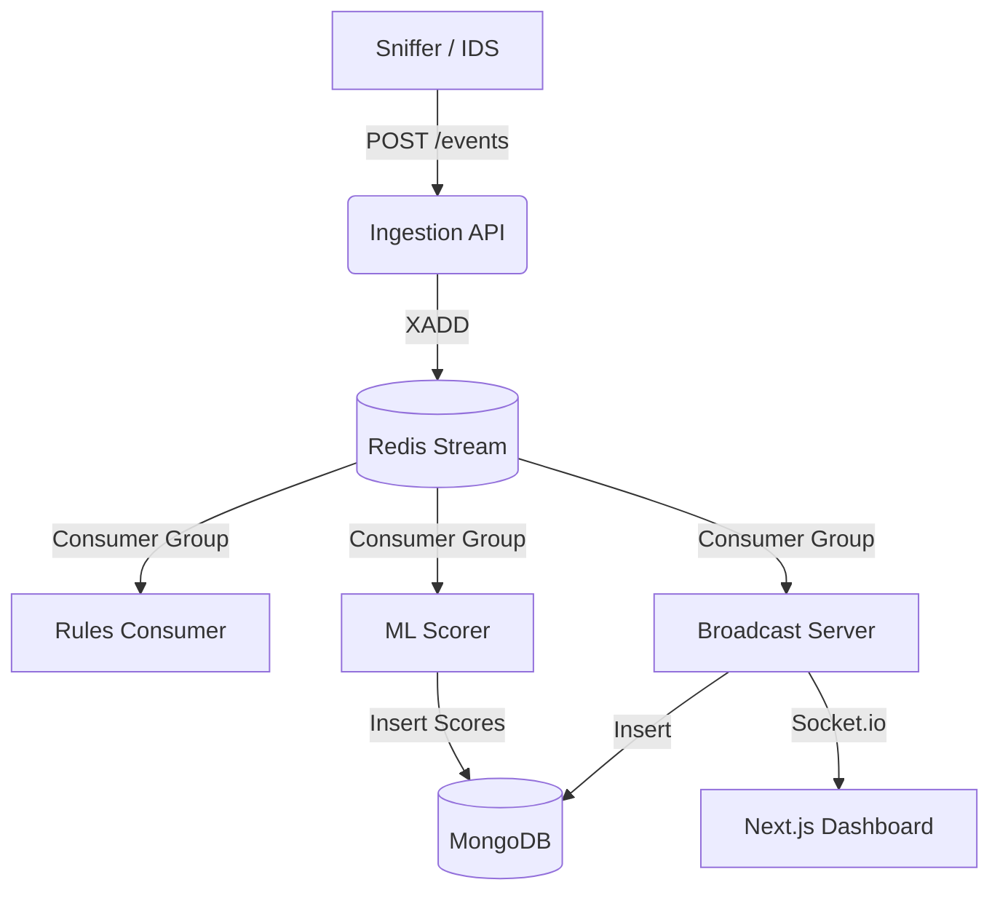

# Mini-XDR: Real-Time Security Event Correlation Platform

## 1. Project Overview
Mini-XDR is a real-time eXtended Detection and Response (XDR) platform. It ingests security events (like port scans, SYN floods, failed logins) from various sources, streams them through a message broker, and processes them using a rules engine and machine learning anomaly detection to bubble up the most critical threats.

### Core Value Proposition
- **Real-Time Processing**: Leverages Redis Streams for low-latency event brokering.
- **Microservices Architecture**: Components scale independently and consume the same event stream via Consumer Groups.
- **Hybrid Detection**: Combines deterministic rules (Rules Engine) and probabilistic anomaly scoring (Machine Learning) to reduce false positives.

## 2. Architecture & Data Flow

## 3. Deep Dive into Components

### A. Ingestion API (Node.js / Express)
- **Role**: The entry point for all events.
- **How it works**: Exposes a `POST /events` endpoint. It validates the shape of incoming events (`source`, `src_ip`, `event_type`) and pushes them to a Redis Stream (`security-events`) using the `XADD` command.

### B. Message Broker (Redis Streams)
- **Role**: Decouples event ingestion from processing.
- **Why Redis Streams?**: It provides persistence, ordered delivery, and **Consumer Groups**. This allows multiple independent services (Rules Engine, ML Scorer, Broadcast Server) to process the exact same stream of events at their own pace without stepping on each other's toes.

### C. Rules Engine (Node.js)
- **Role**: Deterministic threat correlation.
- **How it works**: Reads from the Redis Stream using `XREAD` with blocking. It tracks the state of IPs over a 300-second window. If an IP triggers multiple *distinct* event types (e.g., a port scan followed by a failed login), it escalates the severity.

### D. ML Anomaly Scorer (Python / FastAPI / scikit-learn)
- **Role**: Probabilistic anomaly detection.
- **How it works**: Uses an **Isolation Forest** model, an unsupervised learning algorithm effective for anomaly detection.
- **Feature Extraction**: Extracts features like severity mapping, event count, distinct event types, and distinct ports accessed by a source IP over a 300-second rolling window.
- **Dynamic Training**: Maintains a sliding buffer of recent events. It retrains the model dynamically every 100 events (after an initial cold-start buffer of 20 samples) to adapt to shifting network baselines. Scores are persisted to MongoDB.

### E. Broadcast Server (Node.js / Socket.io)
- **Role**: Data persistence and real-time frontend updates.
- **How it works**:
  - Consumes raw events from Redis and stores them in MongoDB (`events` collection).
  - Polls MongoDB (`security-alerts` collection) for new ML scores.
  - Broadcasts joined events (raw data + anomaly scores) over websockets to the frontend.

### F. Dashboard (Next.js / Tailwind CSS)
- **Role**: Live threat visualization.
- **How it works**: Subscribes to the Socket.io server and displays events in a live table. Rows are color-coded based on the ML anomaly score (Green < 0.3, Yellow 0.3-0.7, Red > 0.7).

### G. Sniffer (Python / Scapy)
- **Role**: Simulates a real IDS.
- **How it works**: Sniffs raw network traffic using Scapy, looking for TCP SYN packets (connection attempts) and UDP DNS queries. It calculates a basic heuristic severity based on recent activity and sends POST requests to the Ingestion API.

## 4. Potential Interview Questions & Answers

**Q: Why use Redis Streams instead of RabbitMQ or Kafka?**
*A:* Redis Streams provides the perfect balance of low latency, persistence, and Consumer Group semantics without the operational overhead of Kafka. It’s lightweight and ideal for a mini-XDR platform where speed is critical.

**Q: How do you handle cold-starts in the ML Scorer?**
*A:* The Isolation Forest model requires a baseline to know what's "normal." The system waits until a minimum number of samples (20) are collected in its rolling buffer before it starts assigning scores. Until then, it returns a score of 0.

**Q: What is the benefit of using an Isolation Forest?**
*A:* It's an unsupervised learning algorithm, meaning we don't need labeled data (which is hard to get for network attacks). It works by isolating anomalies—since malicious activity is usually statistically different from normal traffic, it takes fewer random splits to isolate those data points.

**Q: How does the system handle scaling?**
*A:* Because of the microservices architecture, we can scale independently. If ingestion volume spikes, we can spin up more Ingestion API containers. If ML scoring is a bottleneck, we can add more ML Scorer instances reading from the same consumer group (Redis ensures messages are distributed among consumers in a group).

**Q: What would you improve next?**
*A:*
- **Authentication/Authorization**: Securing the Ingestion API and Dashboard.
- **Data Retention**: Adding TTLs to MongoDB to prevent unbounded growth.
- **Advanced Correlation**: Moving from a simple in-memory Map in the rules engine to a robust stream processing framework like Apache Flink or structured Redis sets for distributed state.
